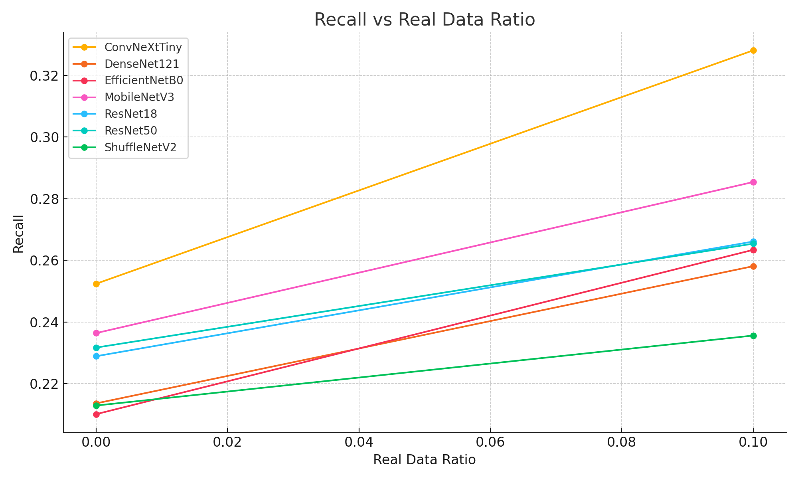

# FER2013 Synthetic Data Recognition Project

This is a group project for **COMP4026/COMP7055 - Computer Vision**, Spring 2024-2025.
Our objective is to evaluate how well facial expression recognition models can be trained using **synthetic data**
generated by StyleGAN2-ADA, compared with real-world data (FER2013).

---

## 🔍 Objective

This project investigates the following:

- Can facial expression models be effectively trained using synthetic data?
- How does performance vary with different real/synthetic data ratios?
- How do different model architectures respond to synthetic data?

---

## 🧱 Dataset: FER2013

- ~35,000 grayscale images (48x48), 7 emotion categories
- Download: [FER2013 on Kaggle](https://www.kaggle.com/datasets/msambare/fer2013)
- Converted to RGB 224x224 for compatibility with pretrained CNNs

---

## 🧠 Method Overview

1. **GAN-based Synthetic Generation**:
   We use pretrained StyleGAN2-ADA models to synthesize expression images.
2. **Real/Synthetic Mixing**:
   The training data is mixed at configurable rates: `[0.0, 0.1, 0.3, 0.5, 1.0]`
3. **Model Zoo**:
   We test with 7 CNN architectures.
4. **Training Pipeline**:
   Uses PyTorch Lightning + DataModule abstraction
5. **Evaluation**:
   Metrics include Accuracy, AUROC, F1 Score, Precision, Recall.

---

## 🧪 Models Compared

| Model          | Type           | Params | Speed         | Notes                    |
|----------------|----------------|--------|---------------|--------------------------|
| ResNet18       | Baseline       | 11M    | Fast          | Good starting point      |
| ResNet50       | Deeper CNN     | 23M    | Medium        | Better accuracy          |
| EfficientNetB0 | Auto-optimized | 5M     | Fast          | Efficient & effective    |
| MobileNetV3    | Lightweight    | 5.4M   | Very Fast     | Mobile-friendly          |
| ShuffleNetV2   | Ultra-light    | 1.3M   | 🔥 Super Fast | For edge devices         |
| DenseNet121    | Feature reuse  | 8M     | Medium        | Deep feature flow        |
| ConvNeXt-Tiny  | Modern CNN     | 28M    | Medium        | Inspired by transformers |

---

## 🗂 Project Structure

```
src/
├── main.py              # CLI entrypoint
├── train.py             # run_experiments(), plots
├── data.py              # FER2013 + synthetic dataloader
├── models.py            # All CNN architectures
├── load_stylegan.py     # Lightweight G_ema loader
├── platform.yaml        # Local vs Kaggle GAN path switch
├── checkpoints/         # Best models by val_f1
└── results/             # Metrics summary (YAML + plots)
```

---

## ⚙️ How to Run

### 🔁 Local (Mac / PC)

```bash
python main.py
```

### 🧪 On Kaggle

```bash
python main.py --platform kaggle
```

Set your `.pkl` paths in `platform.yaml` accordingly.

---

## 📊 Experimental Results

### Accuracy vs Real Data Ratio


### F1 Score vs Real Data Ratio


### Recall vs Real Data Ratio



These charts summarize model performance trends as the proportion of real FER2013 data increases.

---

# 📋 Accuracy by Model and Real Data Ratio

* using x64 images
### Acc per Model across Real Data Ratios

| Model          | 0.0    | 0.1    | 0.3    | 0.5    | 1.0    |
|----------------|--------|--------|--------|--------|--------|
| ConvNeXtTiny   | 0.2917 | 0.3962 | 0.4505 | 0.5013 | 0.5472 |
| DenseNet121    | 0.2627 | 0.3149 | 0.3806 | 0.4140 | 0.4480 |
| EfficientNetB0 | 0.2260 | 0.3037 | 0.3711 | 0.4048 | 0.4494 |
| MobileNetV3    | 0.2811 | 0.3410 | 0.3764 | 0.4182 | 0.4703 |
| ResNet18       | 0.2477 | 0.3129 | 0.3455 | 0.3644 | 0.4572 |
| ResNet50       | 0.2675 | 0.3285 | 0.3748 | 0.4062 | 0.4614 |
| ShuffleNetV2   | 0.2432 | 0.3043 | 0.3753 | 0.4283 | 0.4896 |

### F1 per Model across Real Data Ratios

| Model          | 0.0    | 0.1    | 0.3    | 0.5    | 1.0    |
|----------------|--------|--------|--------|--------|--------|
| ConvNeXtTiny   | 0.2381 | 0.3102 | 0.3653 | 0.4222 | 0.4836 |
| DenseNet121    | 0.2017 | 0.2401 | 0.2944 | 0.3443 | 0.3947 |
| EfficientNetB0 | 0.1863 | 0.2459 | 0.2970 | 0.3300 | 0.3945 |
| MobileNetV3    | 0.2082 | 0.2658 | 0.3052 | 0.3446 | 0.4169 |
| ResNet18       | 0.1951 | 0.2462 | 0.2752 | 0.3095 | 0.3974 |
| ResNet50       | 0.2039 | 0.2468 | 0.3084 | 0.3385 | 0.4033 |
| ShuffleNetV2   | 0.1871 | 0.2131 | 0.2895 | 0.3467 | 0.4177 |

### AUROC per Model across Real Data Ratios

| Model          | 0.0    | 0.1    | 0.3    | 0.5    | 1.0    |
|----------------|--------|--------|--------|--------|--------|
| ConvNeXtTiny   | 0.6361 | 0.6881 | 0.7335 | 0.7554 | 0.8092 |
| DenseNet121    | 0.5946 | 0.6284 | 0.6709 | 0.6926 | 0.7507 |
| EfficientNetB0 | 0.5844 | 0.6268 | 0.6709 | 0.7019 | 0.7527 |
| MobileNetV3    | 0.6050 | 0.6456 | 0.6853 | 0.7107 | 0.7606 |
| ResNet18       | 0.5901 | 0.6264 | 0.6591 | 0.6789 | 0.7461 |
| ResNet50       | 0.5955 | 0.6332 | 0.6812 | 0.7089 | 0.7565 |
| ShuffleNetV2   | 0.5946 | 0.6232 | 0.6770 | 0.7095 | 0.7706 |

---

## 📅 Milestone Schedule

- ✅ Proposal submitted
- ✅ Synthetic + real data processing
- ✅ Model experiments & analysis
- ⏳ Final report due: **28 April 2025**

---

## 📜 License

This project is for academic use only (HKBU COMP4026/7055 coursework).
