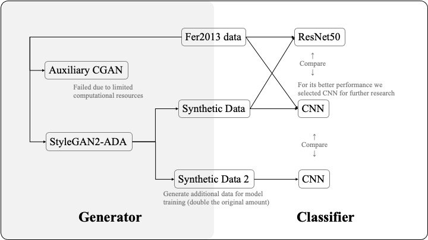

# COMP 7055 Group 2 Project Proposal
Group 2 | 24435015 He Rui | 24427993 Chen Leyan

## Introduction
With increasing concern over privacy in facial data, synthetic image generation has emerged as a promising alternative for data-driven model training. 

In this project, we investigate the feasibility and limitations of classification models trained on synthetic data generated from the FER2013 dataset.

## Preliminary Studie

The initial research examined various methods, including ACGAN and StyleGAN2-ADA for generating synthetic data, and classifiers using ResNet50 and CNN. Due to computational efficiency and superior classification performance, **StyleGAN2-ADA** and **CNN** were retained for further study, as they provided the best balance between data quality and classification effectiveness, leading to improved results.

**If time permits,** we may also explore additional architectures such as **MobileNet** or **EfficientNet** to further enhance our comparative analysis.

## Methodology Rationale

- **Data Privacy Motivation:** Real facial expression data can pose privacy issues. Synthetic images can address this concern while potentially offering comparable learning signals.

- **Generative Model Selection:** StyleGAN2-ADA is chosen for its ability to perform conditional image synthesis and generate high-quality, diverse images. Conditional input (`c_dim = 1`) allows label-driven image generation.

- **Classifier Diversity:** We evaluate both **ResNet50**(pretrained on ImageNet) and **CNN** to see if synthetic data generalization is consistent across different architectures. For further research, we doubled the synthetic data and optimize the CNN classifier to assess the impact of increased data volume on model performance.

- **Evaluation Focus:** All models are evaluated on the same real FER2013 test set, regardless of whether they were trained on real or synthetic data. This ensures a fair comparison.

## Initial Design
The image below illustrates the workflow of our exploration process.

    

### Data Generation
- StyleGAN2-ADA used to generate synthetic facial expression images.
- Training resolutions: 32x32 (4032 kimg) and 64x64 (4216 kimg)
- Output: 28,709 synthetic images(the same to fer dataset) evenly distributed across 7 classes

    

### Classifier Training
- Resize data from 32x32/64x64 to 48x48.
- Train classification models on two datasets (Real data and Synthetic data) using ResNet50 and CNN.
- Train classification models on a larger synthetic dataset and compare the results with previous findings.

### Goal
- Compare the effectiveness of synthetic data across model types
- Analyze whether synthetic data can serve as a viable substitute for real data in FER

## Results

| Model                                  | Accuracy | F1    | AUROC  | Precision | Recall |
| -------------------------------------- | -------- | ----- | ------ | --------- | ------ |
| Real data (FER2013) - ResNet50         | 0.475    | 0.417 | 0.811  | 0.459     | 0.414  |
| Synthetic 32x32 (4032k) - ResNet50     | 0.189    | 0.175 | 0.614  | 0.213     | 0.207  |
| Synthetic 64x64 (4216k) - ResNet50     | 0.206    | 0.189 | 0.6432 | 0.212     | 0.214  |
| Real data (FER2013) - CNN              | 0.61     | 0.61  | 0.88   | 0.62      | 0.61   |
| Synthetic 64x64 - CNN                  | 0.29     | 0.30  | 0.68   | 0.40      | 0.29   |
| Synthetic 64x64 (doubled amount) - CNN | 0.15     | 0.16  | 0.50   | 0.17      | 0.15   |

## Discussion and Insights
- Models trained purely on synthetic data perform worse than those trained on real data.
- Higher resolution (64x64) improves synthetic image effectiveness, but not enough to match real-data performance.
- AUROC > 0.6 suggests that synthetic data captures some useful emotion signal.
- The computational requirements for training a model with double amount data is significantly greater.
- Excessive training epochs would lead to overfitting in CNNs, resulting in poor generalization to the validation set.
- Increasing the amount of data has not improved the classifier's performance.

## Next Steps
- Investigate combined training (real + synthetic data)
- Improve GAN training settings (longer training, higher resolution, label smoothing)
- Analyze feature space similarity using t-SNE, UMAP, or confusion matrices
- Evaluate alternative lightweight models (e.g., MobileNetV3)
- Continuing exploration of ACGAN as time and resources allow
- Balancing class distribution and augmenting training samples
- Improving dataset quality through CNN-based prediction and mismatch correction
- Summarize, analyze, and document all the experimental results
- Analyze why adding more data hasn't improved the classifier's performance and propose a solution to address the issue

## References
- FER2013 Dataset: https://www.kaggle.com/datasets/msambare/fer2013
- StyleGAN2-ADA: https://github.com/NVlabs/stylegan2-ada-pytorch
- PyTorch ResNet50: https://pytorch.org/vision/stable/models/generated/torchvision.models.resnet50.html
- ACGAN: https://machinelearningmastery.com/how-to-develop-an-auxiliary-classifier-gan-ac-gan-from-scratch-with-keras/
- Emotion Recognition: https://www.kaggle.com/code/samanyuk/emotion-recognition
- Facial-Emotion-Recognition: https://www.kaggle.com/code/sumeetagrawal/facial-emotion-recognition
- Human Emotion Detection: https://www.kaggle.com/code/youssefismail20/human-emotion-detection