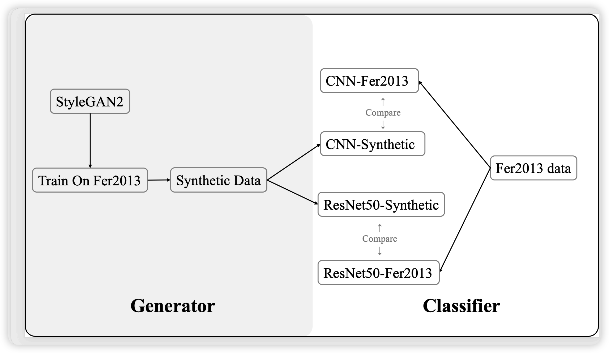
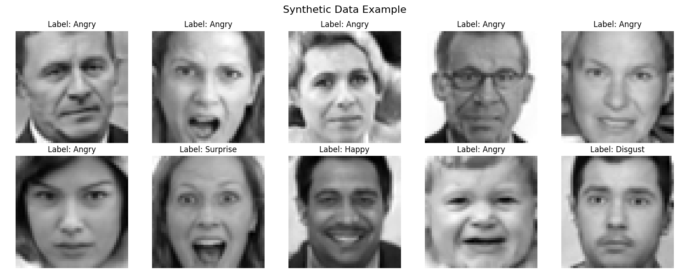

# COMP7055 Group2 Project Report
Group 2 | 24435015 He Rui | 24427993 Chen Leyan

## Introduction
With increasing concern over privacy in facial data, synthetic image generation has emerged as a promising alternative for data-driven model training.

In this project, we investigate the feasibility and limitations of classification models trained on synthetic data generated from the FER2013 dataset.

## Preliminary Study

The initial research examined various methods, including ACGAN and StyleGAN2-ADA for generating synthetic data, and classifiers using ResNet50 and CNN. Due to computational efficiency and superior classification performance, **StyleGAN2-ADA** and **CNN** were retained for further study, as they provided the best balance between data quality and classification effectiveness, leading to improved results.

**If time permits,** we may also explore additional architectures such as **MobileNet** or **EfficientNet** to further enhance our comparative analysis.

## Methodology

- **Data Privacy Motivation:** Real facial expression data can pose privacy issues. Synthetic images can address this concern while potentially offering comparable learning signals.

- **Generative Model Selection:** StyleGAN2-ADA is chosen for its ability to perform conditional image synthesis and generate high-quality, diverse images. Conditional input (`c_dim = 1`) allows label-driven image generation.

- **Classifier Diversity:** We evaluate both **ResNet50**(pretrained on ImageNet) and **CNN** to see if synthetic data generalization is consistent across different architectures. For further research, we doubled the synthetic data and optimize the CNN classifier to assess the impact of increased data volume on model performance.

- **Evaluation Focus:** All models are evaluated on the same real FER2013 test set, regardless of whether they were trained on real or synthetic data. This ensures a fair comparison.

## Initial Design

### Data Generation
- StyleGAN2-ADA used to generate synthetic facial expression images.
- Output: 28,709 synthetic images(the same to fer dataset) evenly distributed across 7 classes

### Classifier Training & Evaluation
Following is How we train and compare models:
* **Step 1**: Train ResNet50 on real FER2013 data → Evaluate on FER2013 test set
* **Step 2**: Train ResNet50 on synthetic images → Evaluate on FER2013 test set
* **Step 3**: Train CNN on real FER2013 data → Evaluate on FER2013 test set
* **Step 4**: Train CNN on the same synthetic images → Evaluate on FER2013 test set
* **Step 5**: Compare the performance of ResNet50 and CNN on real and synthetic data.

### Goal
- Compare the effectiveness of synthetic data across model types
- Analyze whether synthetic data can serve as a viable substitute for real data in FER

## Current Progress

| Model                      | Accuracy | F1 | AUROC | Precision | Recall |
| -------------------------- | -------- | -------- | ----- | --------- | ------ |
| FER2013 - ResNet50         | 0.45     | 0.39     | 0.79  | 0.41      | 0.38   |
| Synthetic 32x32 - ResNet50 | 0.23     | 0.18     | 0.63  | 0.21      | 0.22   |
| Synthetic 64x64 - ResNet50 | 0.29     | 0.23     | 0.64  | 0.23      | 0.25   |
| FER2013 - CNN              | 0.61     | 0.61     | 0.88  | 0.62      | 0.61   |
| Synthetic 64x64 - CNN      | 0.29     | 0.30     | 0.68  | 0.40      | 0.29   |
| Synthetic 64x64 - CNN      | 0.15     | 0.16     | 0.50  | 0.17      | 0.15   |

## Discussion and Insights
* Models trained purely on synthetic data perform worse than those trained on real data.
* AUROC > 0.6 suggests that synthetic data captures some useful emotion signal.
* Higher resolution (64x64) improves synthetic image effectiveness on ResNet50, decreases on
CNN (possible overfilling issue occurred)
* Excessive training epochs would lead to overfitting in CNNs, resulting in poor generalization to
the validation set.

## Next Steps
- Investigate combined training (real + synthetic data)
- Improve GAN training settings (longer training, higher resolution, label smoothing)
- Analyze feature space similarity using t-SNE, UMAP, or confusion matrices
- Evaluate alternative lightweight models (e.g., MobileNetV3)
- Continuing exploration of ACGAN as time and resources allow
- Balancing class distribution and augmenting training samples
- Improving dataset quality through CNN-based prediction and mismatch correction
- Summarize, analyze, and document all the experimental results
- Analyze why adding more data hasn't improved the classifier's performance and propose a solution to address the issue

## References
- FER2013 Dataset: https://www.kaggle.com/datasets/msambare/fer2013
- StyleGAN2-ADA: https://github.com/NVlabs/stylegan2-ada-pytorch
- PyTorch ResNet50: https://pytorch.org/vision/stable/models/generated/torchvision.models.resnet50.html
- ACGAN: https://machinelearningmastery.com/how-to-develop-an-auxiliary-classifier-gan-ac-gan-from-scratch-with-keras/
- Emotion Recognition: https://www.kaggle.com/code/samanyuk/emotion-recognition
- Facial-Emotion-Recognition: https://www.kaggle.com/code/sumeetagrawal/facial-emotion-recognition
- Human Emotion Detection: https://www.kaggle.com/code/youssefismail20/human-emotion-detection
