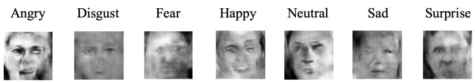

# COMP7055 Report: Synthetic Image Generation for Facial Recognition

**Group 2 | 24435015 He Rui | 24427993 Chen Leyan**

## Abstract

This project explores the use of GAN-generated synthetic data for facial expression classification. Using the FER2013 dataset, we trained multiple CNN models on real, synthetic, and mixed datasets. Synthetic images were produced via various GAN settings, including different image resolutions and ADA configurations. Evaluation results clearly show that models trained solely on synthetic data perform significantly worse. Further analysis using t-SNE, PCA, and Jensen-Shannon Distance reveals clear distributional gaps between real and synthetic data. **We conclude that current GANs are not sufficient to fully replace real data in expression recognition tasks.**

## 1. Introduction
Image generation has gained significant attention in recent years due to advances in deep learning, enabling applications in art, design, and data augmentation. However, the use of real data in model training often raises concerns about privacy, copyright, and data availability.

This project investigates whether synthetic images, generated via modern GAN architectures, can effectively replace real facial expression data in supervised learning tasks. Specifically, we focus on facial expression recognition using models trained on real, synthetic, and mixed datasets, aiming to evaluate the quality and utility of GAN-generated data.

By comparing model performance and analyzing feature distributions, we assess the potential of synthetic data as a privacy-preserving alternative to real images in emotion classification scenarios.

## 2. Methodology

This project investigated whether synthetic facial expression images generated via StyleGAN2-ADA could effectively replace real data in emotion classification tasks using the FER2013 dataset.

### 2.1 Dataset

We used the **FER2013** dataset, which contains 35,887 grayscale facial images (48×48 pixels) categorized into seven emotion classes: anger, disgust, fear, happiness, sadness, surprise, and neutral. The data was split into 28,709 training, 3,589 validation, and 3,589 test samples.

To generate synthetic images, we trained two generative models: **StyleGAN2-ADA** and Conditional GAN **(cGAN)**—on class-specific subsets of FER2013. Image quality was evaluated using the Fréchet Inception Distance **(FID)**. StyleGAN2-ADA achieved FID scores around **8**, reflecting reasonable fidelity for this low-resolution dataset. In contrast, cGAN produced poor-quality and less diverse images with significantly higher FID scores.

Due to its superior performance, we **discarded cGAN** and used StyleGAN2-ADA exclusively in our subsequent experiments. Multiple synthetic datasets were created under different GAN settings (see Section 2.4) and mixed with real data at varying ratios to support a range of training scenarios.

### 2.2 Data Preprocessing

All real and synthetic images were preprocessed to ensure consistent input dimensions.

**1. Grayscale normalization**: All images were normalized to the range [0, 1].
**2. Resolution alignment**: Synthetic images were generated at **32×32** or **64×64** resolutions and then **resized to 48×48** to match the FER2013 image size.

This was necessary because StyleGAN2-ADA only supports generating images at **power-of-two resolutions (e.g., 32, 64)** due to its architecture design. Resizing ensured input consistency across all training samples while allowing us to explore the effects of different GAN resolutions.

### 2.3 Models
We experimented with a range of CNN-based architectures, spanning from lightweight to high-capacity networks. This approach helped us avoid bias from any single model type and allowed us to determine whether certain architectures performed better with synthetic data. The following models were evaluated:

 
 
 
 
 

**Table 1**. Model Parameters
| Model              | Parameters (M) | Description                                             |
| ------------------ | -------------- | ------------------------------------------------------- |
| **ShuffleNetV2**   | 3.5            | Efficient network with depthwise separable convolutions |
| **EfficientNetB0** | 5.3            | Optimized for speed and accuracy in efficient CNN       |
| **MobileNetV3**    | 5.4            | Lightweight model for mobile and edge devices           |
| **DenseNet121**    | 8.0            | Dense connections for improved gradient flow            |
| **ResNet18**       | 11.7           | Lightweight ResNet with fewer layers                    |
| **ResNet50**       | 25.6           | Deeper ResNet with residual connections                 |
| **ConvNeXtTiny**   | 28.6           | Transformer-inspired CNN optimized for vision tasks     |
| **CNN**            | 3.6            | Fundamantal CNN                                         |
| **ResEmoteNet**    | 80.2           | Deep CNN with residual blocks and attention.

**ConvNeXtTiny** is a CNN architecture but was designed with ideas borrowed from Transformer. Unlike traditional CNNs, ConvNeXtTiny incorporates techniques including **layer normalization** and **GELU activation**, which are common in Transformer-based architectures.

### 2.4 GAN Configuration

We experimented with two generative models: **Conditional GAN (cGAN)** and **StyleGAN2-ADA**.

#### 2.4.1 Conditional GAN (cGAN)

We implemented **Conditional GAN (cGAN)** on the FER2013 dataset to generate 48×48 grayscale facial expression images conditioned on 7 emotion labels.

1. The **generator** combined a noise vector and an embedded emotion label via element-wise multiplication, followed by upsampling to generate the image.
2. The **discriminator** embedded the emotion label, reshaped it to the image dimensions, and concatenated it with the image. The result was passed through convolutional layers to predict whether the image was real or fake.

However, due to the small and noisy nature of FER2013, cGAN consistently failed to generate high-quality images, even after extensive hyperparameter tuning. Consequently, we **abandoned cGAN** in favor of **StyleGAN2-ADA**.

#### 2.4.2 StyleGAN2-ADA

We trained three variants of **StyleGAN2-ADA**, based on the configuration by [Nvidia](https://github.com/NVlabs/stylegan2-ada-pytorch)., with settings:
- 64×64 resolution without ADA
- 32×32 resolution without ADA
- 64×64 resolution with ADA enabled

These configurations enabled us to assess the impact of **image resolution** and the adaptive discriminator augmentation **(ADA)** mechanism on the quality of generated images, as well as their downstream impact on classification performance.

### 2.5 Real-Synthetic Data

To investigate the impact of real data availability, we constructed training sets with varying real-to-synthetic ratios: **0.0 (100% synthetic), 0.1, 0.3, 0.5 (mixed real/synthetic), and 1.0 (100% real)**.

These configurations allowed us to assess how increasing the proportion of real data influenced model performance and to evaluate the potential of synthetic data as a replacement for real data.

## 3. Results and Discussion

### 3.1 cGAN

**3.1.1 Model**
The cGAN model takes a noise vector and an embedded emotion label as input, conditioning the output by multiplying them before upsampling to create an image. Meanwhile, the discriminator embeds the input label, reshapes it to match the image dimensions, and concatenates it with the image. It then uses convolutional layers to extract features and outputs a real/fake score.

**3.1.2 Result**

**Figure 2.** Synthetic images generated by CGAN

The analysis of the generated results indicates several key factors contributing to poor performance. Firstly, the simplicity of the model architecture may have limited its ability to adequately capture the intricate nuances of facial expressions. Secondly, the limited size of the dataset likely resulted in unstable training dynamics, leading to divergence around epoch 600. This suggests that the model was unable to generalize effectively due to insufficient training examples.

**3.1.3 Conclusion**
In conclusion, the cGAN struggled to generate realistic facial expression images from the FER2013 dataset. The model's simple architecture was inadequate for capturing the complexity of facial expressions, leading to unstable training and divergence. This indicates that a more advanced model or larger dataset may be required to produce satisfactory results.

### 3.2 StyleGAN

**Figure 3.** Synthetic images generated by StyleGAN

#### 3.2.1 Initial Experiments

We first trained a **StyleGAN2-ADA** model at **32×32** resolution and used it to generate synthetic samples for training a **ResNet50** classifier. The performance was poor, with low accuracy and F1-score, indicating the model failed to generalize from synthetic data.

Suspecting that low resolution caused significant information loss, we trained a second **StyleGAN2ADA** model at **64×64** resolution and repeated the experiment. The performance improved slightly but still fell below expectations, leaving us **unsure whether the improvement was due to resolution or experimental noise**.

To address this systematically, we designed a **controlled experiment** involving:

- **7 CNN models**: As shown in Section 2.3
- **3 GAN configurations**: 32×32, 64×64, 64×64 with ADA
- **5 real/synthetic data ratios**: 0.0, 0.1, 0.3, 0.5, 1.0

Our first focus was on the **ratio = 0.0** condition, i.e., training each model purely on synthetic data.

#### 3.2.2 Baseline Performance on 100% Synthetic Data

The results are summarized in **Table 2**. Regardless of model or GAN type, performance remained poor, with F1-scores typically under 0.25. Even the best model (ConvNeXtTiny) failed to break 0.26 across any GAN setup.

**Table 2**. Average F1-score per Model (100% Synthetic Data)

| Model          | 64×64 GAN | 64×64 ADA GAN | 32×32 GAN |
| -------------- | --------- | ------------- | --------- |
| ConvNeXtTiny   | 0.2344    | 0.2429        | 0.2533    |
| DenseNet121    | 0.2021    | 0.2012        | 0.1975    |
| EfficientNetB0 | 0.1854    | 0.1861        | 0.1898    |
| MobileNetV3    | 0.1952    | 0.2019        | 0.1963    |
| ResNet18       | 0.1837    | 0.1910        | 0.1951    |
| ResNet50       | 0.1821    | 0.1883        | 0.1746    |
| ShuffleNetV2   | 0.2012    | 0.1947        | 0.2075    |

These results confirmed our earlier suspicion: **GAN-generated data alone fails to provide sufficient learning information** for accurate facial expression classification.

This led us to **investigate further**:
- What happens when we gradually add real data?
- Does GAN resolution or augmentation affect performance meaningfully?
- Are all models equally affected?
- Can we find evidence from training dynamics or feature space visualization?

The following sections provide a detailed breakdown of these questions through performance curves, training epoch analysis, and embedding separation diagnostics.

#### 3.2.3 Overall Trends

**Figure 4.** Model F1 Score across Varying Real Data Ratios under Different GAN Training Settings

As shown in **Figure 4**, the F1-score of all models improved steadily as the proportion of real data increased. This trend was consistent across all three GAN types. Notably, when training with 100% synthetic data, all models exhibited poor performance, suggesting that **GAN-generated data alone lacked sufficient class-discriminative information**.

Furthermore, across all GAN settings, models showed **similar F1-score performance curves**, which implies that **the choice of GAN variant had limited impact** on relative model performance.

#### 3.2.3 Comparison of GAN Resolutions

**Figure 5.** Model Accuracy Comparison Using 32×32 vs. 64×64 GAN-Generated Data

To answer whether input resolution affected GAN utility, as shown in **Figure 5**, the performance difference between the two was **model-dependent**:

* Models such as **ResNet50** performed slightly better with 64×64 GAN data.
* Others like **ConvNeXtTiny** achieved similar or slightly lower performance with 64×64 GAN data.
* **ConvNeXtTiny** was the most robust model across all conditions, achieving the highest F1-scores and maintaining better separation in embedding space.

This suggests that **resolution alone was not a dominant factor**, and that architectural characteristics may interact differently with synthetic image quality.

#### 3.2.4 Early Stopping Analysis

**Figure 6.** Early Stopping Epochs across Models Trained on 100% Synthetic vs 100% Real Data

To understand how informative the synthetic data was for training, we analyzed the number of epochs each model ran before early stopping (Max Epoch = 100, Early Stop = 10). As shown in **Figure 6**, when training on 100% synthetic data, most models **converged or saturated very early** ( around 15 epochs):

- For real data, all models trained much longer (stopped after 40 epochs), indicating the availability of richer and more useful gradient signals.
- This further suggests that **GAN-generated images carried limited learning signal**, resulting in fast but shallow convergence.

Early stopping results and embedding visualizations indicate that GAN data does not support long-term, deep learning. which means the synthetic data lacks depth.

#### 3.2.5 Data Distribution Analysis

To better understand why synthetic data performed so poorly, we analyzed the **distributional characteristics** of real and GAN-generated data, as data distribution offers more fundamental insight than mere model performance.

We used **t-SNE** and **PCA** to visualize the feature embeddings learned from real and synthetic data. The features were extracted using a **modified ConvNeXt-Tiny** model:

we removed the classification head and retained the feature vector after global average pooling. This ensured that the visualized features reflect the internal representation learned from the data, rather than final classification logits.

**Figure 7.** t-SNE and PCA Overall

In **Figure 7 (t-SNE and PCA Overall)**, we observed:

**1. Real data (blue)**: Covers a wider range with greater diversity, showing varied distributions across emotion categories.
**2. Synthetic data (red)**: More concentrated, occupying only a subset of the real data’s distribution.

This suggests that GAN-generated data fails to fully capture the diversity of real-world distributions, and there was significant **distributional gap** between synthetic and real data.

**Figure 8.** T-SNE-Happy

A detailed class-specific example is shown in **Figure 9**, where we visualized the "Happy" class.

To quantify the distributional difference, we computed the **Jensen-Shannon Distance (JSD)** between real and GAN-only t-SNE embeddings, which yielded a score of **0.5499**. This value, where:
1. 0 indicates identical distributions,
2. 1 indicates completely different distributions,

suggests that **a significant divergence exists between the two data types**.

#### 3.2.6 Further Research

**Model Performance in Details**

Exploring synthetic data's potential, we questioned whether data with the same distribution as real-world datasets or whether increase the volume of training data—**leveraging the inherent value of data, particularly the ability to generate unlimited synthetic examples** could match real data's effectiveness. Using a standard CNN, Figure 3 compares model performance.

**Figure 9.** CNN Performance Metrics

The model trained on real data reached 0.61 accuracy and 0.88 AUROC. In contrast, synthetic data lagged with 0.29 accuracy and 0.68 AUROC, lacking real-world complexity. Doubling synthetic data further dropped accuracy to 0.15, showing that **more data doesn’t equal better results.** Even with improved distribution, performance stayed well below that of real data.

**Model Evaluation and Options**

Data quality is crucial, but equally important is whether the recognition model can effectively capture data structure and learn from it—hence, we introduce a model that has shown strong performance on Fer2013 recognition task. ResEmoteNet combines residual connections and attention mechanisms to capture complex facial expression features effectively.

**Figure 10.** ResEmoteNet Training Loss

From the Figure10 we get the same hypothesis, if synthetic data shares a similar distribution to real-world data, then training a recognition model on it should yield comparable performance.

The figure shows that with real data (Fer2013), training accuracy steadily improves and validation/test accuracy stabilizes around 0.58–0.60, indicating reasonable generalization. In contrast, with synthetic data, both training and validation accuracies are high, but test accuracy remains extremely low (~0.1), revealing a major generalization gap. This suggests the model overfits the synthetic data, which lacks the necessary features for real-world performance.

## 4. Conclusion and Future Work

### 4.1 Conclusion

The results demonstrated that while generative models like GANs can mimic the appearance of real images, they fail to capture the full diversity and structure of real data. This is reflected in the **FID score of 141.6** for **cGAN** and **FID score of 8** with **JSD of 0.5499** for **StyleGAN2**. These observations collectively indicate that while GAN-generated images can be a useful augmentation tool, they **cannot fully replace real-world data**—especially for nuanced, fine-grained tasks such as facial emotion classification.

Although the recognition models exhibited some performance variation, with lighter models performing slightly better, the differences among them were not substantial. It is important to emphasize that the primary focus of this study was on **the generative models**, not the recognition models.

In conclusion, we conclude that **GAN-generated data cannot fully replace real data** in downstream tasks, as it lacks the richness and diversity of real-world distributions.

### 4.2 Future Work

Future work could explore other generative models, such as **Diffusion Models** or enhanced GAN variations, to better capture the underlying data distributions and improve the fidelity of synthetic data for real-world applications.

The key is not merely to generate high-resolution images, but to systematically generate data that preserves the **diversity** and **distribution** of real data as much as possible. Finding efficient and effective methods to replicate these real-world characteristics is crucial for improving the practical utility of synthetic data in tasks such as facial expression recognition.

## References
[1] M. Sambare, "FER2013 Dataset," Kaggle, 2017. [Online]. Available: https://www.kaggle.com/datasets/msambare/fer2013. [Accessed: 17-Apr-2025].
[2] PyTorch, "resnet50 — Torchvision 0.21 documentation," 2023. [Online]. Available: https://pytorch.org/vision/stable/models/generated/torchvision.models.resnet50.html. [Accessed: 17-Apr-2025].
[3] S. Samanyuk, "Emotion Recognition," Kaggle, 2023. [Online]. Available: https://www.kaggle.com/code/samanyuk/emotion-recognition. [Accessed: 17-Apr-2025].
[4] S. Agrawal, "Facial-Emotion-Recognition," Kaggle, 2023. [Online]. Available: https://www.kaggle.com/code/sumeetagrawal/facial-emotion-recognition. [Accessed: 17-Apr-2025].
[5] Y. Ismail, "Human Emotion Detection," Kaggle, 2023. [Online]. Available: https://www.kaggle.com/code/youssefismail20/human-emotion-detection. [Accessed: 17-Apr-2025].
[6] NVlabs, "StyleGAN2-ADA - Official PyTorch implementation," GitHub, 2021. [Online]. Available: https://github.com/NVlabs/stylegan2-ada-pytorch. [Accessed: 17-Apr-2025].
[7] K. Nayak, "GANs to Generate Synthetic Data," Kaggle, 2022. [Online]. Available: https://www.kaggle.com/code/nayakroshan/gans-to-generate-synthetic-data. [Accessed: 17-Apr-2025].
